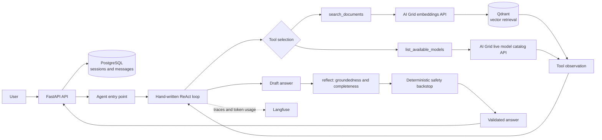

# AI Grid Agentic RAG Assistant

An agentic RAG assistant for official AI Grid documentation, with a FastAPI backend, Qdrant retrieval, PostgreSQL conversation history, and React/Vite chat shells.

## Architecture Overview

This is a production-oriented Agentic RAG system for official AI Grid documentation, not a single retrieval-augmented prompt. The backend implements a hand-written ReAct loop with tool use, iterative retrieval, reflection, deterministic grounding safeguards, live model discovery, vector retrieval, persistent conversations, Langfuse observability, and a repeatable evaluation harness. It does not use LangChain, LangGraph, or LlamaIndex.

Basic RAG usually looks like:

```text
query -> retrieve -> generate
```

This project uses an agentic path:

```text
query -> reason -> choose tool -> retrieve/inspect data -> observe
	   -> reason -> reflect -> validate -> answer
```



1. **Reason**: the AI Grid chat model receives the system prompt and conversation history and chooses whether to answer or call a tool.
2. **Act**: the backend runs `search_documents` for semantic documentation retrieval or `list_available_models` for the live model catalog.
3. **Observe**: the tool result is appended as a tool message, linked to the model's tool call, and the loop continues.
4. **Reflect**: a separate model call judges whether the draft is complete, relevant, and grounded in the retrieved documentation and recent conversation.

### Two-tier answer safety

The answer gate has two independent checks:

- `reflect()` is an LLM judge. It returns structured JSON with `sufficient` and `missing`, and catches incomplete, unsupported, irrelevant, or ambiguous answers.
- `_contains_deprecated_model_name()` is a deterministic backstop for known stale names, currently `gpt oss 20b` and `gpt-oss-120b`.

Both are needed because testing showed that the LLM judge is usually reliable but not deterministic. The backstop guarantees that a known-bad deprecated model name cannot reach a user if `reflect()` has an off run. This matters in practice: current AI Grid pricing/plans documentation still contains a retired model name as a quota label, while that model's dedicated documentation page returns 404. An unsafe or insufficient answer is replaced with a fixed documentation-insufficiency response.

### Agent Execution Flow

The normal documentation path is iterative rather than a fixed one-shot chain:

```text
User query
	|
	v
reason() with tool_choice="auto"
	|
	+--> answer directly for greetings, suitable follow-ups, or simple conversation
	|
	+--> act() -> search_documents(query, category?)
	|                 |
	|                 +--> embed query -> query Qdrant -> return text and source URLs
	|                 |
	|                 +--> observe_step() adds the tool result to the message history
	|                                      |
	|                                      v
	|                              reason() again, up to max_iterations
	|
	+--> act() -> list_available_models() for live model-catalog questions
	|
	v
reflect(question, retrieved context, draft, history)
	|
	v
deterministic deprecated-name backstop
	|
	v
validated answer, then PostgreSQL persistence
```

There are deliberate alternate paths. Model-catalog questions bypass document retrieval and call the live AI Grid `/models` endpoint. Pricing questions remove the catalog tool so pricing is retrieved from documentation. The streaming API buffers retrieval-backed answers until reflection and validation complete; no-search conversation can remain responsive while its reflection check runs observationally in the background. Off-topic weather, sports, cooking, and restaurant questions are rejected early by the streaming path.

## Tech Stack

| Area | Implementation |
| --- | --- |
| API | FastAPI and Uvicorn |
| Agent | Hand-written Python ReAct loop |
| Inference | AI Grid OpenAI-compatible chat completions, embeddings, and model-list APIs |
| Embeddings | `Alibaba-NLP/gte-Qwen2-7B-instruct`, 3584 dimensions |
| Vector store | Qdrant with cosine similarity and configurable top-k retrieval |
| Session store | PostgreSQL 16 with `asyncpg` |
| Ingestion | `requests`, BeautifulSoup, YAML sources, deterministic UUID chunk IDs |
| Observability | Langfuse tracing and token usage reporting |
| Frontend | React 19 and Vite 8 |
| Rendering | `marked`, `marked-katex-extension`, and KaTeX |
| Frontend checks | Oxlint |
| Evaluation | Repeated keyword-based expected/forbidden fact checks |

## Project Structure

```text
.
├── backend/
│   ├── api/main.py             # FastAPI routes and startup initialization
│   ├── core/agent.py           # Tools, ReAct loop, reflection, and chat entry points
│   ├── infrastructure/
│   │   ├── db.py               # PostgreSQL pool, sessions, and message persistence
│   │   ├── embeddings.py       # AI Grid embedding API client
│   │   └── vector_store.py     # Qdrant client, collection creation, and upserts
│   ├── ingestion/
│   │   ├── scraper.py          # Source loading, HTML extraction, chunking, and IDs
│   │   └── run.py              # Scrape, embed, and upsert configured documentation
│   ├── evaluation/run.py       # Repeated evaluation cases and process exit status
│   ├── config/                 # Backend settings and documentation sources
│   └── prompt/system.txt       # Grounding, search, identity, and safety policy
├── requirements.txt             # Pinned Python dependencies
├── docker-compose.yml           # PostgreSQL and Qdrant services
├── .env.example                # Backend environment variable template
├── ai-grid-widget/
│   ├── src/
│   │   ├── App.jsx              # Public shell exports
│   │   ├── App.css              # Shared chat styling
│   │   ├── index.css            # Global styles and fonts
│   │   ├── main.jsx             # PageShell application entry point
│   │   ├── assets/
│   │   │   ├── hero.png
│   │   │   ├── react.svg
│   │   │   └── vite.svg
│   │   └── components/
│   │       ├── ChatCore.jsx     # Shared streaming chat, Markdown, and actions
│   │       ├── PageShell.jsx    # Standalone app with session sidebar
│   │       ├── PageShell.css
│   │       ├── PageShellFix.css
│   │       ├── PageShellTheme.css
│   │       ├── WidgetShell.jsx  # Compact embeddable shell
│   │       └── WidgetShell.css
│   ├── public/
│   │   ├── favicon.svg
│   │   └── icons.svg
│   ├── package.json             # Frontend scripts and dependencies
│   ├── vite.config.js           # /api proxy to FastAPI
│   └── FRONTEND_DOCUMENTATION.md
└── scratch/
	├── list_models.py
	├── test_embed.py
	├── test_qdrant.py
	└── test_tool_call.py
```

`qdrant_storage/`, `postgres_data/`, `node_modules/`, and build output are runtime or generated data, not source required in a fresh checkout.

## Setup

### Prerequisites

- Python 3.10 or newer
- Docker and Docker Compose
- Node.js and npm
- An AI Grid API key with access to chat completions, embeddings, and models
- Network access to the URLs in `backend/config/sources.yaml`

### Environment

Copy `.env.example` to `.env` in the repository root and fill in the AI Grid values:

```bash
cp .env.example .env
```

Required variables are `AI_GRID_API_KEY`, `AI_GRID_BASE_URL`, `DEFAULT_MODEL_LABEL`, and the `POSTGRES_*` connection settings. `LANGFUSE_PUBLIC_KEY`, `LANGFUSE_SECRET_KEY`, and `LANGFUSE_HOST` are optional tracing settings. The base URL is used with `/chat/completions`, `/embeddings`, and `/models`; do not duplicate those paths. Backend runtime settings, source URLs, and prompts are grouped under `backend/config/` and `backend/prompt/`.

The current model and pricing evaluation cases cover `Qwen3-30B-A3B-Thinking`, `google/gemma-4-31B`, `Qwen/Qwen3.8-27B`, `meta-models/Muse-Glimmer-30B`, `deepseek-ocr`, and `zai-org/GLM-OCR`. The live catalog is obtained from AI Grid rather than maintained as a second hard-coded list.

### Install and start services

```bash
python3 -m venv venv
source venv/bin/activate
pip install -r requirements.txt
docker compose up -d
```

Compose exposes PostgreSQL on `localhost:5432` and Qdrant on `localhost:6333`. Its PostgreSQL defaults are `agentic_rag` / `postgres` / `postgres` unless overridden by the compose environment. The FastAPI startup hook creates the PostgreSQL tables and creates the Qdrant `documents` collection if it does not exist, so a fresh clone no longer needs a manual collection bootstrap.

### Ingest documentation

With the services and environment available, either start the backend and call:

```bash
uvicorn backend.api.main:app --host 0.0.0.0 --port 8000 --reload
curl -X POST http://localhost:8000/ingest
```

or run ingestion directly:

```bash
python -m backend.ingestion.run
```

Ingestion loads `backend/config/sources.yaml`, fetches each page, removes common navigation/script/style/footer content, groups paragraphs into chunks of about 800 characters, embeds each chunk, and upserts successful chunks into `documents`. Failed embedding requests are logged and skipped.

### Backend API

```bash
uvicorn backend.api.main:app --host 0.0.0.0 --port 8000 --reload
```

The API is at `http://localhost:8000`; interactive documentation is at `/docs`.

- `POST /chat` accepts `{"question": "...", "session_id": 123}`. Omitting `session_id` creates a session. Normal responses are streamed as `text/plain` and include `X-Session-Id`; if streaming cannot start, the route falls back to JSON containing `answer` and `session_id`.
- `POST /ingest` runs the configured ingestion job.
- Session routes are described in [Session Management](#session-management).

### Frontend

The Vite development proxy rewrites `/api/*` to `http://localhost:8000/*`.

```bash
cd ai-grid-widget
npm install
npm run dev -- --host 0.0.0.0
```

Open `http://localhost:5173/`. `main.jsx` renders `PageShell`, the standalone primary app. `PageShell` includes the resizable/collapsible history sidebar, new-chat flow, delete controls, and light/dark mode. `WidgetShell` remains available for a compact embeddable or full-screen shell:

```jsx
import { WidgetShell } from './src/App.jsx'

export default function EmbeddedAssistant() {
	return <WidgetShell />
}
```

Both shells use `ChatCore` for streaming, Markdown/KaTeX rendering, retry, copy, stop, and session-aware chat behavior. The frontend never receives backend credentials.

Frontend commands:

```bash
npm run lint
npm run build
npm run preview
```

## How the Agent Works

For a normal question, the backend loads the session messages from PostgreSQL, prepends `backend/prompt/system.txt`, and calls the configured `DEFAULT_MODEL_LABEL` with `tool_choice: "auto"`.

- The model can answer from the conversation for greetings, small talk, or suitable follow-ups.
- Documentation questions use `search_documents`, which embeds the query, searches Qdrant, optionally filters by `company`, `getting-started`, `models`, or `pricing`, and returns text with source URLs.
- A model-catalog question is recognized by `_is_model_catalog_question()` and bypasses retrieval. The backend calls AI Grid `/models` and formats the live IDs. Pricing questions remove `list_available_models` from the tool set so pricing is retrieved from documentation instead of confused with catalog membership.
- The ReAct loop can execute up to `agent.max_iterations` searches (5 in `backend/config/config.yaml`). If it reaches the limit, a final call uses `tool_choice: "none"`.
- The non-streaming path runs blocking `reflect()` and then the deterministic backstop before saving and returning the answer.
- The streaming path buffers the model output internally. If retrieval happened (`search_iterations > 0`), it runs the same blocking safety gate before yielding the answer, sacrificing token-by-token display for grounded-answer verification. For small talk and simple follow-ups with no search, it yields immediately and schedules a background observational `reflect()` check; this preserves responsiveness because those answers do not depend on newly retrieved documents. The deterministic deprecated-name backstop still applies to the blocking path.
- Obvious weather, sports, cooking, and restaurant questions are rejected early in the streaming path.

The system prompt requires official-document grounding, focused iterative retrieval, coverage of multi-part questions, explicit uncertainty, and safe handling of retrieved text as data.

## Session Management

Each chat gets a PostgreSQL session. `PageShell` loads recent conversations into its sidebar, fetches a selected session's messages, and can start a new chat or delete one. The sidebar can be collapsed and manually resized; all chat behavior remains in `ChatCore`.

The backend exposes:

| Route | Purpose |
| --- | --- |
| `GET /sessions` | List sessions with IDs, first-user-message titles, and last-update timestamps |
| `GET /sessions/{id}/messages` | Load ordered messages; returns 404 for an unknown session |
| `DELETE /sessions/{id}` | Delete the session and its messages transactionally; returns 404 when absent |

## Running Evaluations

Run the harness from the repository root after starting PostgreSQL, Qdrant, ingesting documents, and configuring AI Grid:

```bash
source venv/bin/activate
python -m backend.evaluation.run
```

The evaluator is `backend/evaluation/run.py` (the repository does not contain a separate root `run_eval.py`). It runs seven cases three times each by default. Cases cover OCR/image handling, current model capabilities and comparisons, refund-policy uncertainty, exact pricing, multi-model recommendations, and the deprecated-model regression. `score_answer()` uses case-insensitive substring matching. An expected fact can be a tuple of acceptable alternative phrases, and forbidden facts must never appear.

The script prints each answer, per-run scores, and hit counts. `MIN_HIT_RATE = 1` means every expected fact must appear at least once across the three runs; a forbidden fact fails if it appears even once. It exits `0` only when every case passes and `1` when any case fails, so it can gate CI. A failure should be read from the case summary: identify the fact with fewer than the required hits, then inspect the printed answers to distinguish retrieval, model nondeterminism, grounding/reflection rejection, or an outdated expectation. This remains a lightweight behavioral check, not a semantic, citation, latency, or cost evaluator.

The currently measurable evaluation signals are:

- expected-fact hit counts across repeated runs
- forbidden-fact violation detection
- per-case pass/fail and process exit status

The harness does not currently measure retrieval precision, citation correctness, latency, or token cost reliably, so no benchmark values for those metrics are reported here. CI also validates Python compilation/imports, starts PostgreSQL and Qdrant, ingests the configured documentation through AI Grid, and then runs this same evaluator.

Latest local run: 7/7 cases passed, with every expected fact observed in all 3/3 repetitions and the forbidden deprecated-model fact absent in all 3/3 repetitions. These results depend on the live AI Grid model and documentation APIs; reproduce them with the commands below rather than treating them as a static benchmark.

### Reproduce CI Evaluation

GitHub Actions requires `AI_GRID_API_KEY`, `AI_GRID_BASE_URL`, and `DEFAULT_MODEL_LABEL` repository secrets. Locally, provide those values in `.env`, then run:

```bash
docker compose up -d
python -m backend.ingestion.run
python -m backend.evaluation.run
```

The workflow uses Python 3.11 and the pinned `requirements.txt`; the `numpy` pin is compatible with that runtime.

## Known Limitations and Design Decisions

- The custom Python ReAct orchestration is deliberate; LangChain and LangGraph are not dependencies.
- Retrieval-based streaming answers are intentionally buffered until the blocking safety check finishes. This trades token-by-token display for preventing an unsupported answer from being shown. No-search small talk and simple follow-ups keep the faster background-check path.
- Only the first tool call in a model response is executed. Unknown tools and malformed arguments are not converted into tailored user-facing errors.
- The chat model comes from `DEFAULT_MODEL_LABEL`; the embedding model remains hard-coded in `embeddings.py`, even though model metadata also exists in YAML.
- Qdrant is fixed to `localhost:6333`; the collection is now auto-created at FastAPI startup, but deployment configuration is still local-only.
- Ingestion has no scheduler, refresh/versioning policy, reranking, or deduplication policy. It skips chunks whose embedding request fails.
- PostgreSQL tables are created with `CREATE TABLE IF NOT EXISTS`, but there are no migrations, authentication, authorization, rate limits, or tenant isolation.
- The API has no explicit CORS configuration and is intended for local use or a same-origin/properly configured reverse proxy.
- Evaluation is substring-based and does not prove factual completeness, retrieval precision, citation correctness, latency, or token cost.

Resolved engineering issues:

- The streaming route previously allowed retrieval-based text to reach the user without reflection. It now performs the blocking gate before yielding those answers, while preserving fast unblocked output for no-search interactions.
- The LLM reflection judge was empirically found to be nondeterministic around a retired model name still present in live plan/quota documentation. The deterministic backstop now guarantees that known deprecated names are rejected.
- The evaluation runner previously always exited successfully. It now returns process exit code `0` for a pass and `1` for a failure, and accepts alternative expected phrasings.
- The `documents` collection previously had to exist before ingestion. FastAPI startup now calls `create_collection_if_not_exists()` for fresh clones.
- The frontend was previously one widget-oriented shell. Shared `ChatCore`, standalone `PageShell`, and optional `WidgetShell` now separate the primary full-page experience from compact embedding.

## Credits and Context

This project is a focused AI Grid documentation assistant. Its source corpus is configured in `backend/config/sources.yaml` and is fetched from official AI Grid pages. AI Grid provides the hosted inference, embedding, and live model-catalog APIs; Qdrant and PostgreSQL provide local retrieval and session persistence. See [ai-grid-widget/FRONTEND_DOCUMENTATION.md](ai-grid-widget/FRONTEND_DOCUMENTATION.md) for frontend-specific operation and deployment notes.

To stop local services while preserving their persistent data:

```bash
docker compose down
```
